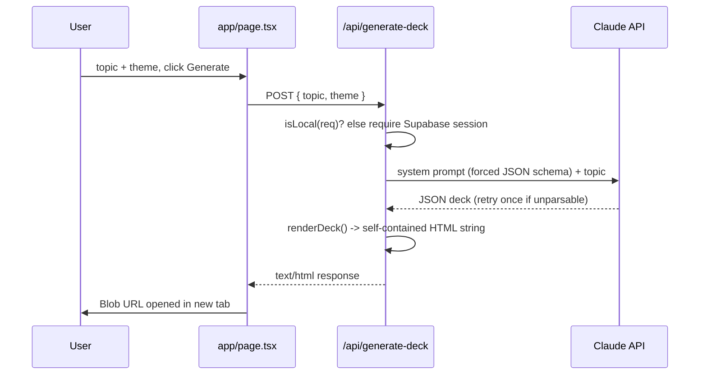

<div align="center">

# Decks

**AI slide-deck generator - topic in, polished HTML deck out.**

[](https://decks-bheng.vercel.app)
[](https://nextjs.org)
[](https://react.dev)
[](https://www.typescriptlang.org)
[](tests/api/generate-deck.test.ts)
[](LICENSE)

</div>

Type a topic, pick one of 6 visual themes, and get back a self-contained HTML slide deck - no login required on localhost, Google-gated in production.

## Features

- **One-prompt AI generation** - describe a topic and Claude (`claude-sonnet-4-6` via `@anthropic-ai/sdk`) returns a strict JSON deck (cover, stack, 3-4 feature slides, checklist, roadmap, summary). The route auto-retries once with a stronger instruction if the model's first reply isn't parseable JSON.
- **6 built-in themes** - Minimal, Dark, Neon, Corporate, Playful, Gradient - each is an accent color layered onto one shared light "slides" renderer, picked in the UI before generating.
- **Self-contained HTML output** - `renderDeck()` returns one HTML string with inlined CSS and a small vanilla-JS navigator (arrow keys, space, swipe, `Cmd/Ctrl+Enter` to generate). The client wraps the response in a `Blob` and opens it in a new tab - the deck never touches a database.
- **11+ slide section types** - `cover`, `feature`, `stack`, `checklist`, `roadmap`, `summary`, `cards`, `table`, `kv`, `badges`, `text` are exposed to the AI schema; `html`, `diagram`, `versus`, `timeline`, and `stackcards` exist in the renderer for hand-authored decks outside the generation flow.
- **A second render mode** - besides `"slides"`, the same renderer has a dark, GitHub-style `"report"` mode for scrollable documents, shared with other bunlongheng tools.
- **Google OAuth, single-email allowlist** - Supabase Auth gates `/api/generate-deck` in production against `ALLOWED_EMAIL`; requests from `localhost`/LAN hosts bypass auth entirely for local dev (`lib/is-local.ts`, `middleware.ts`).
- **Optional embedded diagrams** - a `diagram` section posts Mermaid source to a companion service at `diagrams-bheng.vercel.app` (bearer-token authenticated) and embeds the result.

## How it works

1. User types a topic and picks a theme in the sticker-bomb UI (`app/page.tsx`), then hits **Generate** (or `Cmd/Ctrl+Enter`).
2. `POST /api/generate-deck` (`app/api/generate-deck/route.ts`) checks `isLocal(req)`; off localhost it requires a valid Supabase session.
3. The route calls `claude-sonnet-4-6` with a system prompt that forces a strict JSON deck schema, pulls the JSON block out of the reply, and retries once if the first attempt doesn't parse.
4. The user's theme choice overwrites `mode`/`theme`/`accent` on the parsed deck, then `renderDeck()` (`lib/deck-gen.ts`) turns the JSON into one self-contained HTML string.
5. The HTML comes back as the response body; the browser blobs it and opens it in a new tab.



## Tech stack

| Layer | Technology |
|-------|------------|
| Framework | Next.js 15 (App Router), React 19, TypeScript |
| Styling | Tailwind CSS |
| AI | Claude API (`@anthropic-ai/sdk`), model `claude-sonnet-4-6` |
| Auth + DB | Supabase (PostgreSQL + Auth, Google OAuth) |
| Diagrams | `diagrams-bheng.vercel.app` companion service (bearer-token, optional) |
| Hosting | Vercel (installs with Bun, builds with `next build`) |
| Testing | Vitest (unit) + Playwright (E2E) |

## Getting started

```bash
git clone https://github.com/bunlongheng/decks.git
cd decks
npm install
cp .env.local.example .env.local   # fill in the values below
npm run dev
```

Open http://localhost:3010. On localhost, `/api/generate-deck` skips auth entirely, so generation works with just `ANTHROPIC_API_KEY` set.

| Command | Description |
|---------|-------------|
| `npm run dev` | Start dev server on port 3010 |
| `npm run build` | Production build |
| `npm run start` | Start production server on port 3010 |
| `npm run prod` | Build + start, bound to `0.0.0.0` |
| `npm run lint` | Next.js lint |
| `npm run test` | Run Vitest unit tests |
| `npm run test:e2e` | Run Playwright E2E tests |

### Environment variables

| Variable | Purpose |
|----------|---------|
| `ANTHROPIC_API_KEY` | Claude API key for deck generation |
| `AI_API_SECRET` | Bearer token for the `diagrams-bheng` service |
| `NEXT_PUBLIC_SUPABASE_URL` | Supabase project URL |
| `NEXT_PUBLIC_SUPABASE_ANON_KEY` | Supabase anon key (client-side) |
| `SUPABASE_SERVICE_ROLE_KEY` | Supabase service role key (server-only) |
| `ALLOWED_EMAIL` | Email allowed to sign in, in production |
| `NEXT_PUBLIC_SITE_URL` | Public site URL for OAuth redirects |

## License

[MIT](LICENSE) (c) Bunlong Heng
